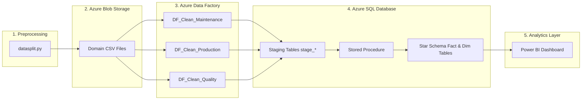
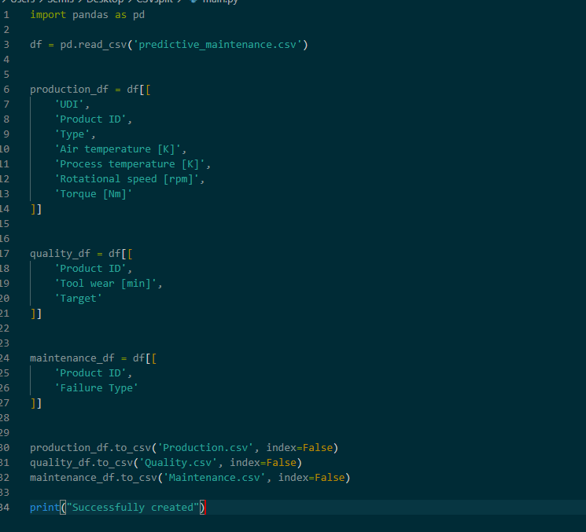
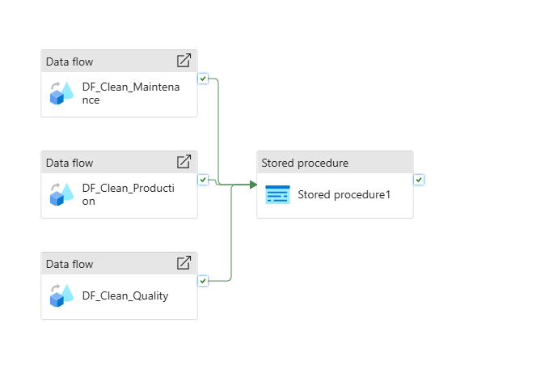
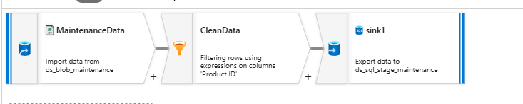
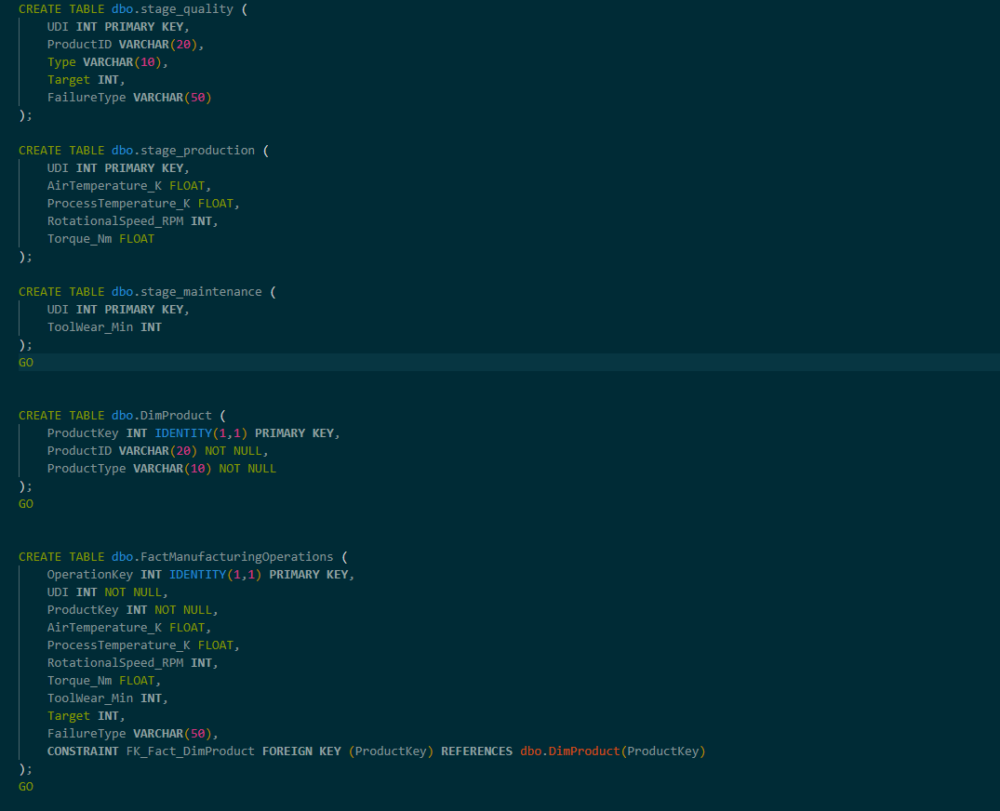
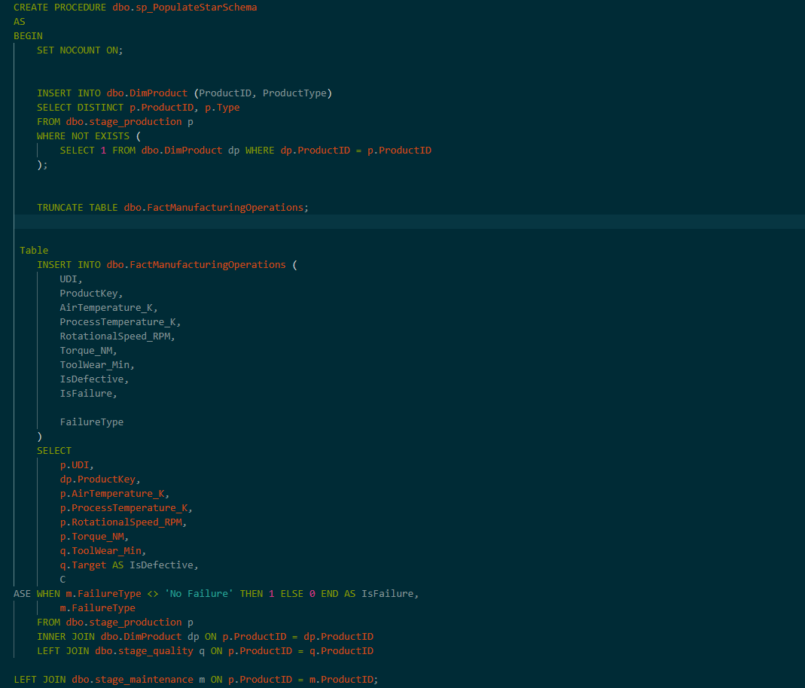

# ⚙️ Azure Manufacturing Data Pipeline

This project demonstrates an **Azure data engineering pipeline** that ingests raw manufacturing telemetry, transforms it, and loads it into an analytical model in Azure SQL Database for downstream reporting.

---

## Repository Structure

📁 01-azure-cloud-pipeline/             
├── 📁 adf-pipelines/                  
├── 📁 raw-data/                       
├── 📁 python-script/                   
├── 📁 sql-scripts/                     
├── 📁 powerbi/                         
└── 📁 images/                          

## Project Overview

The goal is to simulate a real production data platform for predictive maintenance analytics:

- Ingest machine sensor + failure data
- Split source data into domain-specific datasets
- Transform and clean data in Azure Data Factory Mapping Data Flows
- Load curated data into Azure SQL staging tables
- Populate a star-schema-style analytical model using T-SQL

**Business use case:** enable operations and quality teams to analyze machine condition, failure patterns, and defect risk.

---

## Architecture

**Core services used:**

- **Azure Blob Storage** → raw and split CSV storage
- **Azure Data Factory** → orchestration + mapping data flows
- **Azure SQL Database** → staging + dimensional/fact model
- **Python (Pandas)** → preprocessing/splitting raw file

### Architecture Diagram

### 1. Preprocessing (Python)
* **Action:** The `datasplit.py` script takes the initial raw dataset and splits it into three domain-specific CSV files (`Production`, `Quality`, and `Maintenance`).
* **Purpose:** Separates the incoming data stream into structured functional areas before pushing to the cloud.

---

### 2. Cloud Ingestion (Azure Blob Storage)
* **Action:** The split CSV files are uploaded into Azure Blob Storage containers.
* **Purpose:** Serves as the landing storage layer (raw object storage) where raw files wait to be processed by the ETL engine.

---

### 3. Data Cleaning & Staging (Azure Data Factory - Data Flows)
* **Action:** Azure Data Factory triggers three parallel Mapping Data Flows:
  * `DF_Clean_Maintenance`
  * `DF_Clean_Production`
  * `DF_Clean_Quality`
* **What happens inside:** Each Data Flow cleans missing/null values, fixes data types, and validates value ranges.
* **Sink (Destination):** At the final step (Sink) of each Data Flow, ADF writes the cleaned data directly into **Staging Tables** (`stage_*`) inside Azure SQL Database.

---

### 4. Dependency Gate (ADF Orchestration)
* **Action:** The green arrows in the pipeline act as **success triggers** (control flow).
* **Purpose:** ADF pauses and waits until **all three** cleaning Data Flows complete successfully before running downstream tasks. This guarantees data completeness and prevents partial loads.

---

### 5. Dimensional Modeling (Azure SQL Stored Procedure)
* **Action:** Once all staging tables are populated, ADF executes `Stored procedure1` inside Azure SQL Database.
* **Purpose:** The stored procedure runs T-SQL code to join the clean `stage_*` tables together and populate the final **Star Schema** (`Fact` and `Dim` tables) for reporting.

---

### 6. Analytics & Visualization (Power BI)
* **Action:** Power BI connects directly to the final Star Schema in Azure SQL Database.
* **Purpose:** Generates interactive dashboards, machine performance metrics, and maintenance analytics from accurate, fully cleaned data.
---
                    

## Data Layer

### Source dataset

- `raw-data/predictive_maintenance.csv`
- Includes telemetry and labels such as:
  - Air/process temperature
  - Rotational speed
  - Torque
  - Tool wear
  - Failure type and target label

### Split datasets

Generated by `python-script /datasplit.py`:

- `Production.csv` → process and sensor fields
- `Quality.csv` → tool wear + defect target
- `Maintenance.csv` → failure type metadata

#### Dataset Size & Scope
* **Source File:** `predictive_maintenance.csv` (10,000 records × 10 columns | ~518 KB)
* **Domain Splits:**
  * **`Production.csv`** (7 columns): Machine operating telemetry (temperatures, speed, torque).
  * **`Quality.csv`** (3 columns): Tool wear and failure target flags.
  * **`Maintenance.csv`** (2 columns): Categorical root-cause failure types.

---

#### Why Split into Domain Datasets?
The raw monolithic file was decoupled into three domain files (`Production`, `Quality`, `Maintenance`) using `datasplit.py` for three primary reasons:

 **Faster Processing (Parallel Execution):** Azure Data Factory runs all 3 Data Flows concurrently, speeding up total pipeline execution time.
 **Fault Isolation:** If the maintenance log format changes or fails, real-time machine telemetry continues ingesting without disruption.
 **Real-World Domain Alignment:** Mirrors enterprise microservices where Operations, Quality Control, and Maintenance operate with independent data ownership.

---

## Data Processing (Python)

The Python script performs:

1. Read full manufacturing source CSV
2. Select and separate production, quality, and maintenance columns
3. Export three CSV outputs for pipeline ingestion

### Python Script

**Simple Python Script using pandas to split CSV file to 3 parts.**

---

## Orchestration & Transformations (Azure Data Factory)

The exported ARM template (`adf-pipelines/arm_template/ARMTemplateForFactory.json`) contains:

- Linked services for Blob and Azure SQL
- Datasets for blob sources and SQL staging targets
- Pipeline: `PL_TRANSFORM_MaintenanceProdQuality`
- Data Flows:
  - `DF_Clean_Maintenance`
  - `DF_Clean_Production`
  - `DF_Clean_Quality`

### ADF Pipeline

### Data Flow

### Data Transformation vs. Pipeline Orchestration

* **Mapping Data Flow (Data Transformation):** Handles row-level logic. It ingests raw CSVs from Blob Storage, filters/cleans invalid `Product ID` records, and writes the output directly to Azure SQL staging tables.
* **Pipeline Canvas (Workflow Orchestration):** Manages task execution order. It runs three cleaning Data Flows concurrently and triggers the SQL Stored Procedure only after all staging tables successfully complete.

## Data Warehouse Modeling (Azure SQL)

SQL assets:

- `sql-scripts/azure_sql_schema.sql`
  - Staging tables: `stage_production`, `stage_quality`, `stage_maintenance`
  - Analytical tables: `DimProduct`, `FactManufacturingOperations`
- `sql-scripts/PopulateStarSchema.sql`
  - Stored procedure: `sp_PopulateStarSchema`
  - Inserts/updates dimension members and refreshes fact data

### SQL Schema

### Stored Procedure

### Data Warehouse & Star Schema Transformation (Azure SQL)

The SQL script transitions raw ingested data from temporary staging into a structured Star Schema optimized for analytics:

1. **Staging Layer (`stage_*`):** Landing tables receiving transformed outputs directly from ADF Data Flows.
2. **Dimension Table (`DimProduct`):** Stores unique product attribute definitions (`ProductID`, `ProductType`).
3. **Fact Table (`FactManufacturingOperations`):** Stores core operational metrics, sensor readings, and failure flags linked to `DimProduct` via Foreign Key (`ProductKey`).
4. **Stored Procedure (`sp_PopulateStarSchema`):** Automates dimensional modeling by updating dimensions, clearing old fact data, and joining staging streams into the final Fact table.
---

## Result

This project showcases practical capabilities in:

- Cloud ETL orchestration in Azure
- Data modeling for analytics
- SQL-based transformation and load patterns
- Reproducible pipeline packaging via ARM templates

### Results / Dashboard Placeholder

> **Your explanation placeholder:**  
> Add measurable outcomes (row counts processed, run time, quality improvements, reporting benefits).

