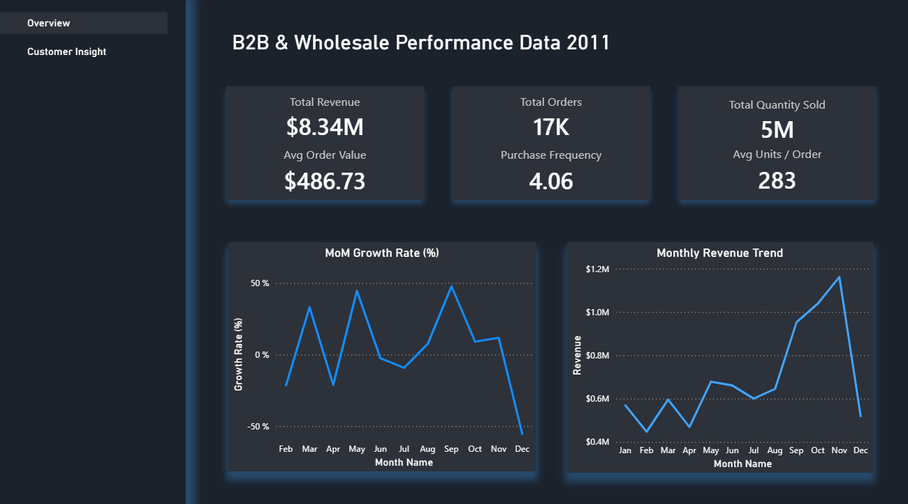
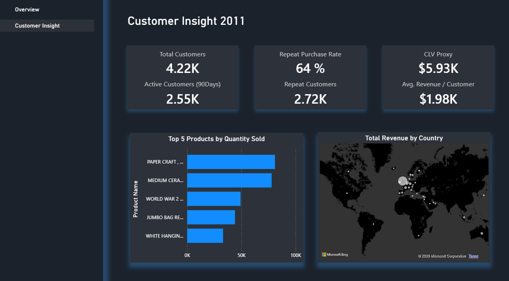
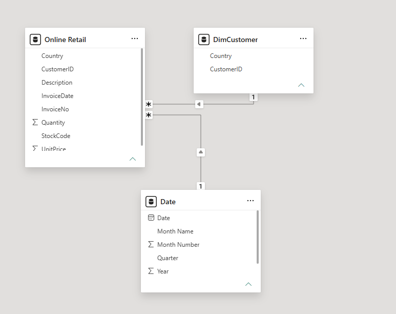
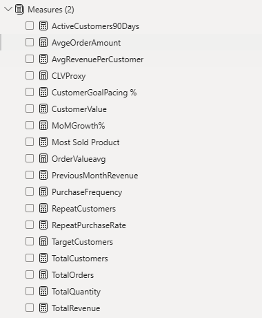

## Analytics & Visualization (Power BI)

This project features an interactive Power BI dashboard designed to analyze B2B and wholesale retail transactions. It provides executive and operational visibility into financial growth, order velocity, customer retention health, and product performance driven by custom DAX logic and an optimized dimensional model.

---

### Data Cleansing & ETL Pipeline (Power Query & M)

Before modeling, the raw transactional dataset (~541K rows) was cleansed, filtered, and transformed inside **Power Query** using custom **M Language** steps to ensure strict data integrity:

* **Cancellation & Anomaly Handling:** Filtered out return/cancellation records (invoices starting with `C`) and removed non-commercial anomalies (`Quantity <= 0` and `UnitPrice <= 0`) to avoid skewing revenue, order volume, and unit metrics.
* **Deduplication & Text Hygiene:** Purged over 5,000+ exact duplicate rows and applied string transformations (trimming trailing whitespace, standardizing uppercase naming) to line-item descriptions.
* **Missing Value & Customer ID Governance:** Managed 135K+ records lacking assigned `CustomerID` values, separating unassigned guest transactions from identified B2B profiles so customer-level KPIs (`CLVProxy`, `RepeatPurchaseRate`, `AvgRevenuePerCustomer`) remained accurate.
* **Explicit Type Optimization:** Cast all schema data types explicitly (`UnitPrice` as Currency/Fixed Decimal, `Quantity` as Whole Number, `InvoiceDate` as DateTime/Date) to improve query folding efficiency and prevent schema mismatch errors during refresh.

---

### Dashboard Pages

#### Executive Overview (`B2B & Wholesale Performance Data 2011`)
Focuses on macro business performance, revenue trajectories, order dynamics, and month-over-month growth patterns.

* **Key Performance Indicators (KPIs):**
  * **Total Revenue:** **$8.34M**
  * **Average Order Value (AOV):** **$486.73**
  * **Total Orders:** **17K**
  * **Purchase Frequency:** **4.06**
  * **Total Quantity Sold:** **5M units**
  * **Average Units / Order:** **283 units**

* **Analytical Visualizations:**
  * **Monthly Revenue Trend (Line Chart):** Tracks revenue performance throughout 2011, highlighting baseline stability (~$0.5M–$0.7M) and a massive Q4 sales surge peaking in November at over $1.15M.
  * **MoM Growth Rate % (Line Chart):** Evaluates month-over-month sales velocity, pinpointing growth acceleration spikes (May and September reaching ~50% growth) versus seasonal dips.

---

#### Customer Insights (`Customer Insight 2011`)
Provides granular analysis on customer retention, lifetime value proxies, top-selling product lines, and global revenue distribution.

* **Customer Health KPIs:**
  * **Total Customers:** **4.22K**
  * **Active Customers (90 Days):** **2.55K**
  * **Repeat Purchase Rate:** **64%**
  * **Repeat Customers:** **2.72K**
  * **CLV Proxy:** **$5.93K**
  * **Avg Revenue / Customer:** **$1.98K**

* **Analytical Visualizations:**
  * **Top 5 Products by Quantity Sold (Bar Chart):** Ranks top SKUs by unit volume sold, led by *Paper Craft*, *Medium Ceramic Top Table*, *World War 2 Gliders*, *Jumbo Bag Red Retrospot*, and *White Hanging Heart T-Light Holder*.
  * **Total Revenue by Country (Map Visual):** Maps global sales distribution, highlighting core market density in the UK and Western Europe alongside secondary international expansion.

---

### Data Model & DAX Architecture

#### Star Schema Semantic Model
The Power BI semantic model is structured in a clean **Star Schema** to deliver optimal filter propagation and fast report rendering:

* **Fact Table (`Online Retail`):** Contains core line-item transactional data (`Quantity`, `UnitPrice`, `InvoiceNo`, `InvoiceDate`).
* **Dimension Tables:**
  * `DimCustomer`: Stores customer attribute metadata (`CustomerID`, `Country`).
  * `Date`: A dedicated calendar dimension supporting time-intelligence functions (`Date`, `Month Name`, `Month Number`, `Quarter`, `Year`).
* **Relationships:** Standard 1 : * (One-to-Many) single-directional relationships linking dimensions to the central fact table.

---

#### DAX Measure Repository
All calculations are organized within a central `Measures` folder for clean governance and maintainability:

| Measure | Description / Purpose |
| :--- | :--- |
| `TotalRevenue` | Calculates total aggregate sales volume (`Quantity * UnitPrice`). |
| `TotalOrders` | Counts unique invoices/orders processed (`DISTINCTCOUNT(InvoiceNo)`). |
| `TotalQuantity` | Measures total units sold across all line items (`SUM(Quantity)`). |
| `TotalCustomers` | Counts distinct customer profiles with purchase history (`DISTINCTCOUNT(CustomerID)`). |
| `ActiveCustomers90Days` | Filters distinct customers with purchase activity in the past 90 days. |
| `RepeatCustomers` | Identifies and counts customers who have placed more than one order. |
| `RepeatPurchaseRate` | Computes the percentage of total customers with more than one historical order (`RepeatCustomers / TotalCustomers`). |
| `TargetCustomers` | Defines the benchmark or target baseline for total customer acquisition. |
| `CustomerGoalPacing %` | Measures current customer count progress against target goals (`TotalCustomers / TargetCustomers`). |
| `CustomerValue` | Evaluates overall monetary value generated per customer. |
| `PurchaseFrequency` | Calculates average number of order transactions per customer (`TotalOrders / TotalCustomers`). |
| `CLVProxy` | Estimates Customer Lifetime Value proxy based on purchase frequency and average spend. |
| `AvgRevenuePerCustomer` | Evaluates mean revenue generated per distinct customer profile (`TotalRevenue / TotalCustomers`). |
| `AvgeOrderAmount` | Computes the average transaction value per invoice (`TotalRevenue / TotalOrders`). |
| `OrderValueAvg` | Evaluates average line-item or order size across transactions. |
| `PreviousMonthRevenue` | Time-intelligence measure fetching total sales revenue from the prior calendar month. |
| `MoMGrowth%` | Time-intelligence calculation evaluating percentage revenue change vs. previous month. |
| `Most Sold Product` | Identifies the top-performing product/SKU by quantity sold or revenue. |
