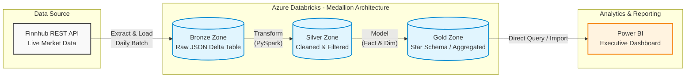
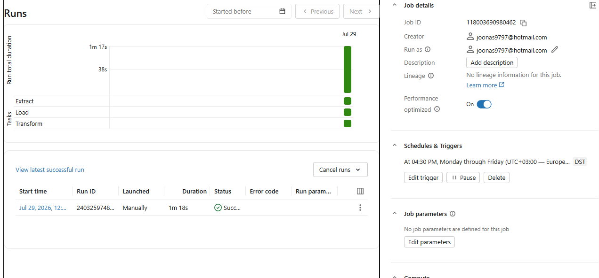
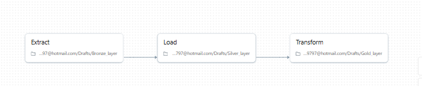

<h1>End-to-End Financial Data Lakehouse (ELT)</h1>

This project demonstrates an automated cloud data lakehouse architecture that ingests daily stock market transactions, processes them via a Medallion architecture using Azure Databricks, and serves the curated data to a Power BI executive dashboard.

<h2>Repository Structure</h2>

<pre><code>📁 End-to-End Financial Data Lakehouse(ELT)/
├── 📁 images
├── 📁 schemas
├── 📁 pbix 
└── README.md
</code></pre>

<h2>Project Overview</h2>

The goal is to simulate a real-world financial data platform capable of highly reliable, daily data ingestion and executive reporting:

<ol>
    <li>Ingest daily stock market data from the Finnhub REST API using a single-day fetch.</li>
    <li>Extract the data, Load it into a raw storage layer, and Transform it through Medallion architecture (Bronze, Silver, Gold).</li>
    <li>Process lightweight, daily increments to optimize compute performance and eliminate the need for complex upserts.</li>
    <li>Serve a clean star-schema model directly to Power BI for real-time reporting.</li>
</ol>

<strong>Business use case:</strong> Enable financial analysts and executives to track real-time market intelligence, daily return metrics, and cross-company stock volatility in a centralized Bloomberg-style terminal.

<h2>Architecture</h2>

Core services used:

<ul>
    <li><strong>Finnhub API</strong> &rarr; Source of daily stock quotes and market data.</li>
    <li><strong>Azure Databricks</strong> &rarr; Compute engine for data processing (PySpark).</li>
    <li><strong>Delta Lake</strong> &rarr; Storage format providing ACID transactions for the Lakehouse.</li>
    <li><strong>Power BI</strong> &rarr; Data visualization and DAX metric engine.</li>
</ul>

<h3>Architecture Diagram</h3>

<h3>1. Extract (Finnhub API &rarr; Raw Data)</h3>
<ul>
    <li><strong>Action:</strong> The <code>Extract</code> script fetches a single day of JSON payload data from the Finnhub API for selected stock tickers.</li>
    <li><strong>Purpose:</strong> Pulls the daily market telemetry efficiently, focusing exclusively on the current day's performance metrics.</li>
</ul>

<h3>2. Load (Raw Data &rarr; Bronze)</h3>
<ul>
    <li><strong>Action:</strong> The <code>Load</code> script lands the extracted JSON data into a Delta Bronze table without any modifications.</li>
    <li><strong>Purpose:</strong> Acts as the raw, append-only landing zone in the data lakehouse, preserving historical API responses in their original format.</li>
</ul>

<h3>3. Transform (Bronze &rarr; Silver &rarr; Gold)</h3>
<ul>
    <li><strong>Action:</strong> The <code>Transform</code> script reads the Bronze table, standardizes column names, enforces data types, and structures the data into a final Star Schema (Fact and Dimension tables).</li>
    <li><strong>Purpose:</strong> Cleanses data and shapes it into dimensional models ready for Power BI consumption, processing daily batches cleanly without requiring complex <code>MERGE</code> (upsert) logic.</li>
</ul>

<h3>4. Dependency Gate (Databricks Workflows)</h3>

<ul>
    <li><strong>Action:</strong> Databricks orchestrates the scripts sequentially on a strict Cron schedule (<code>0 30 16 ? * MON-FRI</code>).</li>
    <li><strong>Purpose:</strong> Runs daily at 16:30 EST (30 minutes after US market close) to guarantee all final trade settlements are captured and loaded in correct sequential order.</li>
</ul>

<h3>5. Analytics &amp; Visualization (Power BI)</h3>
<ul>
    <li><strong>Action:</strong> Power BI connects to the Gold Delta tables.</li>
    <li><strong>Purpose:</strong> Transforms the cleaned Star Schema into a dark-themed financial dashboard utilizing dynamic DAX measures for daily returns and maximum ingested date indicators.</li>
</ul>

<h2>Data Layer</h2>

<strong>Source Dataset</strong>

<ul>
    <li>Live REST API payload containing real-time metrics: <code>current_price</code>, <code>previous_close</code>, <code>day_high</code>, <code>day_low</code>, and <code>fetched_at</code> timestamp.</li>
</ul>

<strong>Dataset Size &amp; Scope</strong>

<ul>
    <li><strong>Volume:</strong> Highly scalable; fetching 1-day windows for a portfolio of tech stocks (e.g., AAPL, MSFT, TSLA).</li>
    <li><strong>Format:</strong> API JSON &rarr; Delta Parquet.</li>
</ul>

<strong>Why Use Single-Day Ingestion?</strong>

By fetching only a single day's data instead of overlapping historical windows, the pipeline becomes lightweight and highly performant. It eliminates the need for complex <code>MERGE</code> logic in the Delta tables, significantly reducing cloud compute overhead and execution time while still providing accurate, day-to-day market intelligence.

<h2>Data Processing (Databricks Medallion Architecture)</h2>

The pipeline separates data processing into three distinct zones, maximizing data governance and traceability:

<ol>
    <li><strong>Bronze (Raw):</strong> Append-only layer. Retains all historical API responses without alteration.</li>
    <li><strong>Silver (Cleansed):</strong> Filtered and standardized. Datetime logic and basic transformations are applied here.</li>
    <li><strong>Gold (Business-Level):</strong> Aggregated and structured specifically for Power BI consumption (<code>dim_company</code> and <code>fact_stock_quotes</code>).</li>
</ol>

<h2>Orchestration (Databricks Workflows)</h2>

The job execution sequence runs through the configured files:

<ul>
    <li><strong>Task 1:</strong> Execute <code>Extract</code>.</li>
    <li><strong>Task 2:</strong> Execute <code>Load</code> (Depends on Task 1).</li>
    <li><strong>Task 3:</strong> Execute <code>Transform</code> (Depends on Task 2).</li>
</ul>

By orchestrating natively in Databricks, the cluster spins up automatically, executes the ETL/ELT pipeline in under a few minutes, and immediately terminates to save cloud compute costs.

<h2>Data Warehouse Modeling (Gold Layer)</h2>

The analytical data model uses a standard Star Schema to ensure high performance in Power BI:

<ul>
    <li><strong>Dimension Table (<code>dim_company</code>):</strong> Contains static details about the tracked entities (e.g., <code>ticker</code>, <code>company_name</code>, <code>sector</code>).</li>
    <li><strong>Fact Table (<code>fact_stock_quotes</code>):</strong> Contains the rapidly changing daily telemetry (prices, daily returns) linked via <code>ticker</code>.</li>
</ul>

<h2>Dashboard Showcase</h2>

The Power BI report is styled as a professional Executive Market Intelligence Dashboard.

<strong>Key Features:</strong>

<ul>
    <li><strong>Dynamic Time Intelligence:</strong> Uses Relative Date slicers that automatically shift forward as the pipeline updates daily.</li>
    <li><strong>Advanced DAX:</strong> Measures dynamically calculate <code>Latest Price</code> and <code>Daily Return %</code> based on the maximum ingested date.</li>
    <li><strong>UI/UX:</strong> Organized into three distinct zones: high-level KPI cards, a primary trend line chart for time-series analysis, and a detailed cross-company comparison matrix.</li>
</ul>

<em>(Insert Dashboard Screenshot Here)</em>

